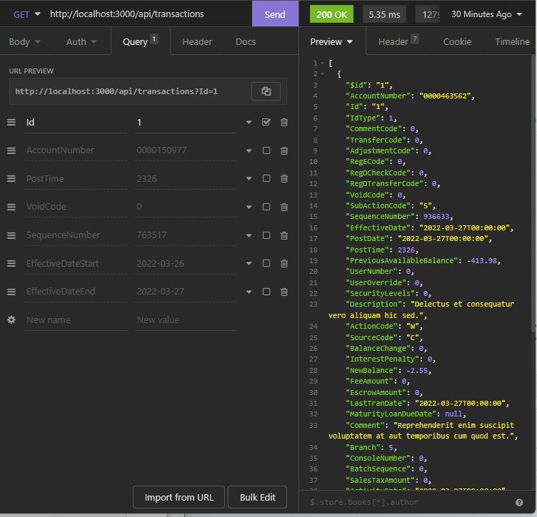

# Members 1st Api Assessment

## Description
This API was built with the intention to satisfy and exceed the given build requirements. Users are able to query data utilizing http requests on a given local json file. 

## Table of Contents
- [Installation](#installation)
- [Usage](#usage)
- [Testing](#testing)
- [Technologies](#technologies)

## Installation
First, clone the repository to your local machine with the command `git clone <url>`. Then from the terminal, you must cd into the root directory and install all required dependencies with the command `npm i`.

## Usage
Users may access the API via an API client software such as Postman or Insomnia. In order to run the server you must first be in the root directory. After that, run the API with the command `npm start`. Next, open your API client software of choice and create a GET request to `http://localhost:300/api/transactions` adding on query parameters with the Query input section. 

## Testing
Testing was carried our via Jest. Tests we're used to ensure that the API returned the expected responses for various use cases. In order to run Jest tests within the application, you must ensure that `Jest` and `SuperTest` have been installed. Once in the root directory, run the command `npm run test`

## Technologies
For this API I utilized a multitude of packages. `Nodemon` and `Morgan` were used to restart the server seamlessly during code updates. Morgan was used to verify what requests were being sent as well as the response from the API for the given request. `Jest` was the testing framework and `Insomnia` was the API client I used. 
